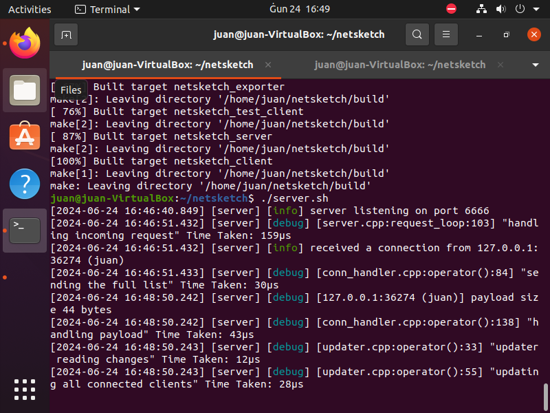
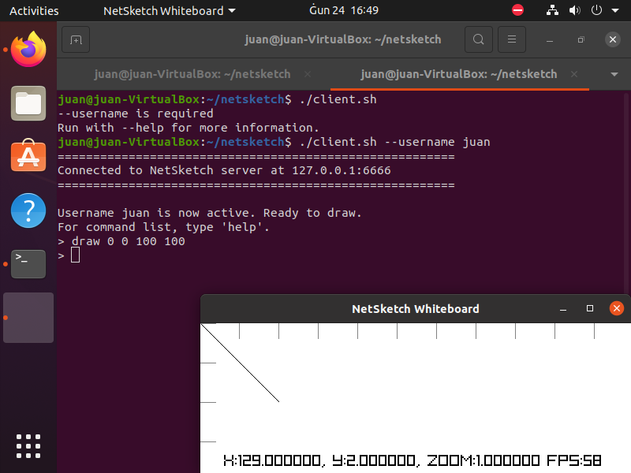

# CPS2008 Coursework

This repository contains the source code for all the tasks which
had to be completed for the CPS2008 coursework. CPS2008 is a
compulsory unit at the University of Malta which has to be taken
by third year Computer Science and Mathematics undergraduates
during the second semester.

## Dependencies

In a VirtualBox VM running Ubuntu 20.04, the following
dependencies were required:

- git
- cmake
- g++
- libx11-data
- libx11-dev
- libxrandr2
- libxrandr-dev
- libxinerama1
- libxinerama-dev
- libxcursor1
- libxcursor-dev
- libxi6
- libxi-dev
- mesa-common-dev

Additionally, please ensure that the VM has access to the
internet since, the project clones the following dependencies
from GitHub:

- [gabime/spdlog](https://github.com/gabime/spdlog)
- [raysan5/raylib](https://github.com/raysan5/raylib)
- [fmtlib/fmt](https://github.com/fmtlib/fmt)
- [USCiLab/cereal](https://github.com/USCiLab/cereal)
- [CLIUtils/cli11](https://github.com/CLIUtils/CLI11)

The repository
[fffaraz/awesome-cpp](https://github.com/fffaraz/awesome-cpp)
was a great help for finding brilliant libraries.

## Build Instructions

`.gitignore` is being used to make sure that all the files
generated by `cmake` and `lualatex` during compilation are not
pushed to the repository.

Built and run on:

- Arch Linux (Linux Kernel 6.9.6 x86\_64) using `gcc` (Version
14.1.1).
- Ubuntu 20.04 (x86\_64 VirtualBox VM) using `g++` (Version
9.x.x).

Starting from the root of the directory, for a debug build run
the `build.sh` script.

```
./build.sh
```

If you wish for a release build run the `build-rel.sh` script.


```
./build-rel.sh
```

This generates the `netsketch_server`, `netsketch_client` and
`netsketch_test_client` executables in the `./build/src`
directory.

The server can be run by using `server.sh` script.

```
./server.sh
```

A client can be run by using the `client.sh` script.

```
./client.sh --username user
```

## Help

### Server Usage

```
> ./server.sh -h
Usage: build/src/netsketch_server [OPTIONS]

Options:
  -h,--help                   Print this help message and exit
  --port UINT [6666]          The port number of the NetSketch server
  --time-out FLOAT [10]       The time out (in minutes) for an inactive client
```

### Client Usage

```
> ./client.sh -h
Usage: build/src/netsketch_client [OPTIONS]

Options:
  -h,--help                   Print this help message and exit
  --gui,--no-gui{false}       use a GUI
  --username TEXT REQUIRED    The nickname of the user (used for identification on a NetSketch server)
  --ipv4 TEXT [127.0.0.1]     IPv4 address of machine hosting a server
  --port UINT [6666]          port number of a NetSketch server
```

### Test Client Usage

```
> ./build/src/netsketch_test_client -h
Usage: ./build/src/netsketch_test_client [OPTIONS]

Options:
  -h,--help                   Print this help message and exit
  --server TEXT [127.0.0.1]   The IPv4 address of a machine hosting a NetSketch server
  --port UINT [6666]          The port number of a NetSketch server
  --iterations UINT [100]     The number of requests the Test Client will send to the NetSketch server
  --interval FLOAT [1]        The interval between number of requests the Test Client will send to the NetSketch server
  --expected-responses UINT REQUIRED
                              The number of expected responses from the NetSketch Server
  --username TEXT REQUIRED    The nickname of the user (used for identification on a NetSketch server)
  --other-actions{false},--other-actions{false}
                              Enable generating other actions apart from drawing (e.g. Undo, Clear & Delete)
```

## Images of the Server and Client Running on the Ubuntu 20.04 VM




